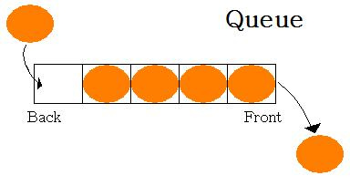

---

## Web Application Hacking

---

## Introduction

 - `os.walk`
 - lists vs queues vs deques
 - threads vs processes
 - classes vs functions
 - http.server

---
## Lists (stack) vs Queues

---
## timeit is your friend!

    $ python -mtimeit -s'q=range(10000)' 'q.append(23); q.pop(0)'
    100000 loops, best of 3: 5.81 usec per loop

    $ python -mtimeit -s'import collections; q=collections.deque(range(10000))' 'q.append(23); q.popleft()'
    1000000 loops, best of 3: 0.574 usec per loop
---
Multithreading is for responsive apps. 

Multiprocessing is for parallelism.
---
## Pick your app

https://www.capterra.com/content-management-software/

https://www.makeuseof.com/tag/10-popular-content-management-systems-online/

---

## Map your app locally

Review `mapper.py`
---

## Enumerate *in the wild* Part 1

Run `mapper.py`
---

## Enumerate  *in the wild* Part 2

Review and run `dirfinder.py`

---

## Attack!

Review and run `wp_killer.py`

Proxies!

---

## Homework

 - Pick a popular web app to explore
 - Download the app source files
 - Write/test your own mapper
 - Write/test your own dir_finder
 - Write/test your own killer

Add your code into your `web` module